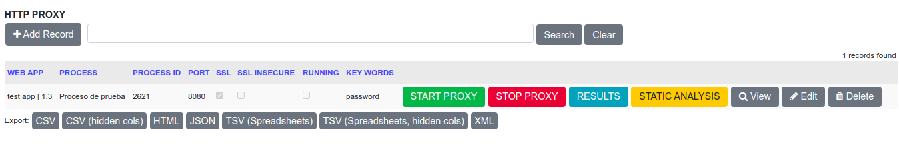
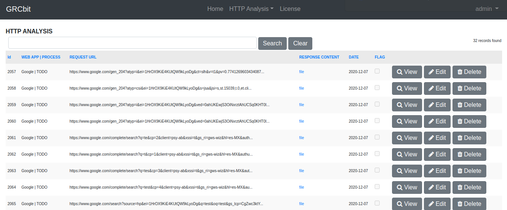
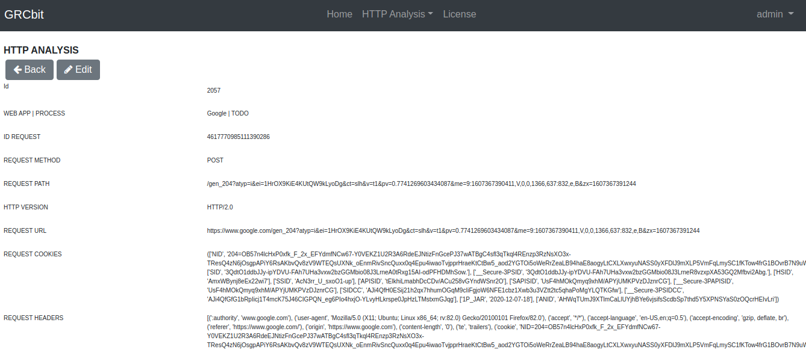
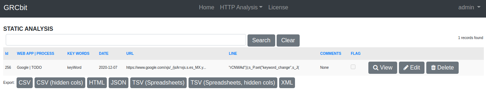

HTTP Proxy

Mitmproxy based tool to capture HTTP traffic, the results are saved in a sqlite database. Simple Static Analysis can be done on resources obtained. 
The tool does not allow modification of data (parameters, headers, etc.), since it is considered for use in the early stages related to information gathering in the execution of tests.

Herramienta basada en mitmproxy para capturar trafico HTTP, los resultados los guarda en una base de datos sqlite. Se puede realizar un analisis estatico sobre los recursos obtenidos. 
La herramienta no permite modificacion de datos (parametros, headers, etc), ya que esta considerada para utilizarla en las primeras fases relacionada al levantamiento de informacion en la ejecucion de pruebas.

